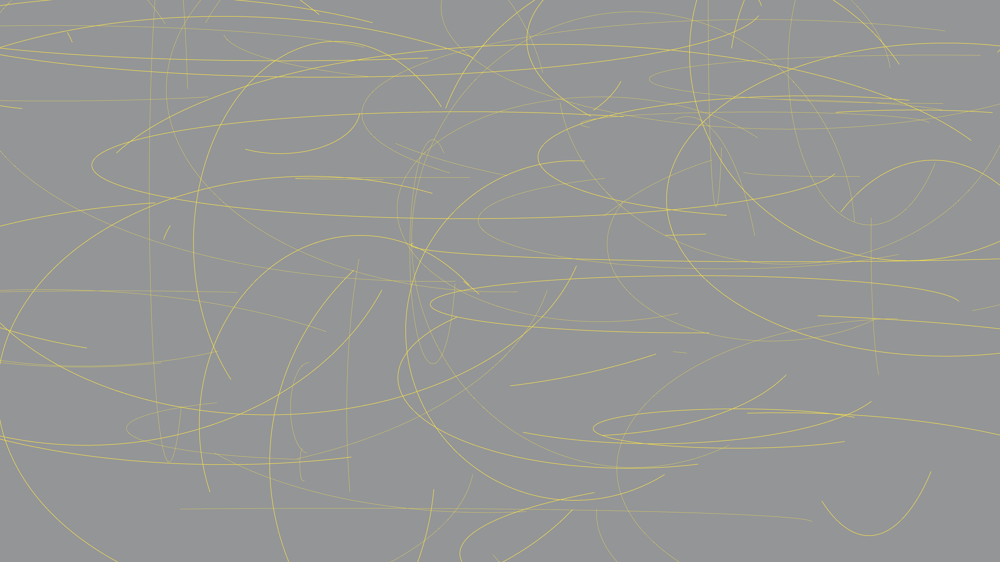

<h1 align='center'>Generative Art</h1>

---

---
 

  |
  <a href=#motivation>Motivation</a>  |
  <a href=#explanation-of-repository-contents>Explanation of Repository Contents</a>  |
  <a href=#overview>Overview</a> |
  <a href=#current-domains-of-interest>Current Domains of Interest</a> |
  <a href=#resources>Resources</a> |
    

---

## Motivation

## Explanation of Repository Contents

## Overview 

## Current Domains of Interest

### Audio 

### Visual

- [Processing: Programming Language Designed for Creating Images, Animation, and Interactivity](https://github.com/wyattowalsh/generative-art/tree/main/processing)

and 

- [Generative Adversarial Networks (GANs)](https://github.com/wyattowalsh/generative-art/tree/main/GANs)

## Resources
