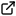

# Generative Methods for Audio Synthesis

## Contents

- [Notes](#Notes)
- [Papers](#Papers)

## Notes

- Several different types of architectures:
  - GAN (Generative Adversarial Network)
    - Implicit Density 
    - Examples: WaveGAN (2018); GANSynth (2019)
  - Autoregressive 
    - Explicit, tractable density
    - Examples: WaveNet (2016); SampleRNN (2016)
  - VAEs
    - Explicit, approximate density
    - Examples: NSynth (2017)

### Autoregressive models

- Designed with sequential data in mind
- Data is assumed to have a canonical sequential direction
- Learn to predict next sample in time given what has come just prior
- Known to be easier to train in comparison to other model families

## Model List

|**Name**|**Developer**|**Architecture**|**Year**|**Notes**|**Links**|
|---|---|---|---|---|---|
|SampleRNN||Autoregressive|2016| Each layer in SampleRNN is comprised of RNNs working to capture dependencies at a certain timescale||
|WaveNet|DeepMind|Autoregressive|2016| CNN based ||
|GRUV|Stanford|RNN|2015|||
## Papers

|**Paper Title**|**Summary**|**Link**|
|---|---|---|
|*Deep generative models for musical audio synthesis*| Review of currently existing methodologies.  | |

## Resources

|**Name**|**Notes**|**Link**|
|---|---|---|
|Awesome Deep Learning Music GitHub Repo| List of articles and resources | |
